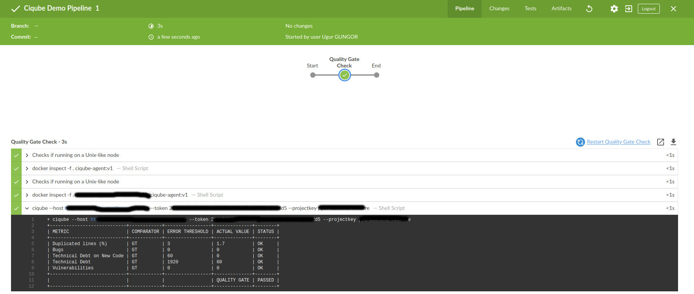
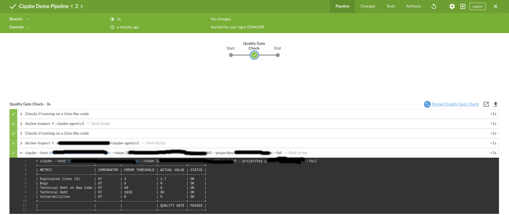
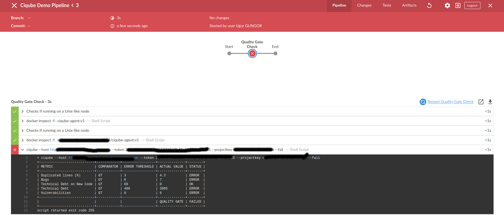

# Ciqube

A simple sonarqube quality gate result checking tool. Put your sonarqube quality gate results to ci/cd pipelines, break pipelines according to quality gate result if you want to.

## Installation and Usage

Ciqube designed for working in ci/cd pipelines. For my case I use it in Jenkins Pipelines by using docker agents. I've built docker image using Dockerfile below, then pushed it to my internal registry. You can simply use it in CircleCi, Gitlab Ci, Azure DevOps etc because they all already support docker agents or dockerfiles.

### Dockerfile
```
FROM golang:1.13 as builder

ENV GO111MODULE=on

WORKDIR /app

RUN git clone https://github.com/gungorugur/ciqube.git

WORKDIR /app/ciqube

RUN go mod download

RUN CGO_ENABLED=0 GOOS=linux go build -o ciqube cmd/ciqube.go

FROM alpine:latest

COPY --from=builder /app/ciqube/ciqube /usr/local/bin/ciqube

```

### Example Jenkins Pipeline
```
pipeline {
    agent none
    stages {
        stage('Quality Gate Check') {
            
            agent {
                docker {
                    image "ciqube-agent:v1"
                    registryUrl "http://myinternalregistry.local"
                }
            }
           
        steps {       
            sh "ciqube --host http://sonarqube.mycompany.com --token MY_TOKEN --projectkey  MY_PROJECT_KEY --fail"
          }
        }
    }
}
```

You need to pass host, projectkey and sonarqube token. If you pass --fail parameter pipeline will break according to quality gate result.

```
Usage of ciqube:
  -fail
        Pipeline fails, if quality gateway fails (Optional)
  -host string
        Sonarqube Host URL (Required)
  -projectkey string
        Sonarqube Project Key (Required)
  -token string
        Sonarqube Token (Required)

```

#### Example succeeded pipeline without fail parameter.


#### Example succeeded pipeline with fail parameter.


#### Example failed pipeline with fail parameter.



### TODO

- [ ] Add more tests
- [ ] Add wait-progress flag for background tasks in the queue